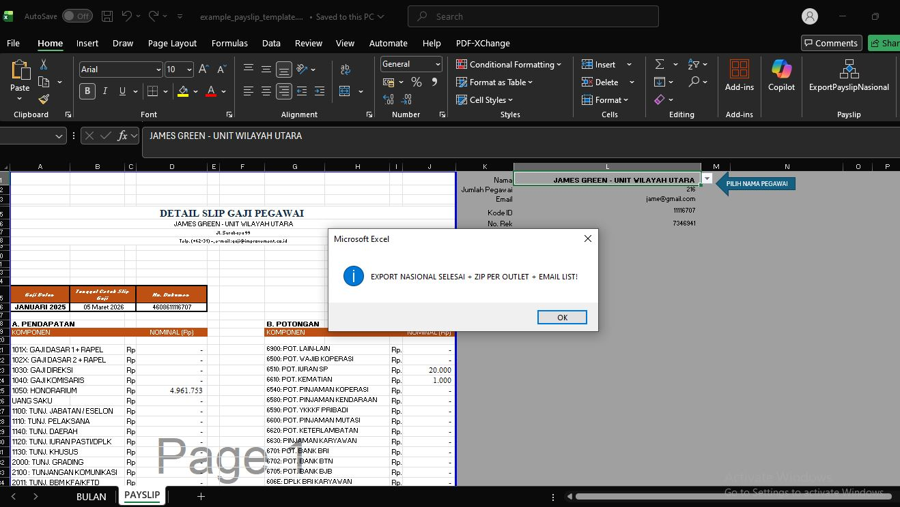
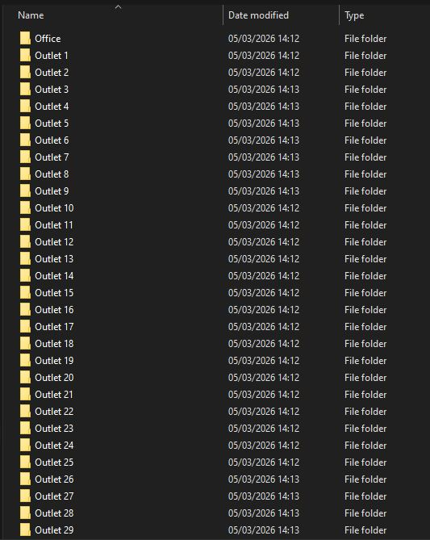
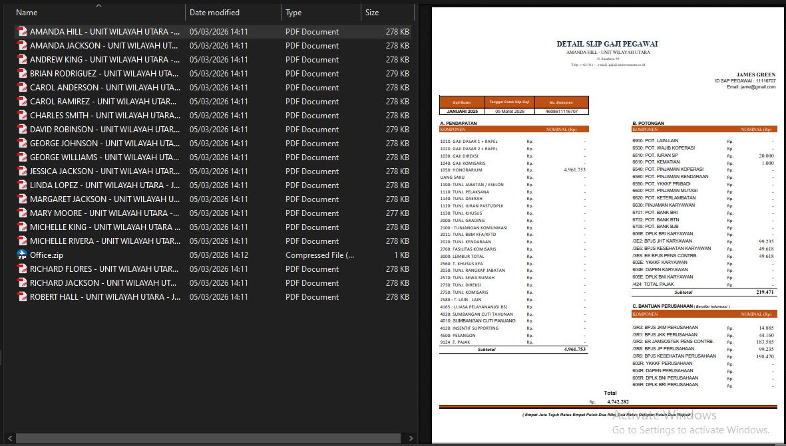

# Excel Payslip Automation System

An automated HR payroll distribution system built using Excel VBA.

This project was developed to solve a common HR operational problem: 
manually exporting hundreds of employee payslips every month.

The system automatically generates PDF payslips for each employee, organizes them by business unit and outlet, and prepares files for distribution.

Processing 300+ employees now takes less than 1 minute.

---

## Key Features

• Automatic PDF generation for each employee  
• Auto-detect payroll data headers  
• Dynamic employee selection via index system  
• Folder grouping by Business Unit and Outlet  
• Automatic ZIP compression per outlet  
• Duplicate file prevention  
• Email distribution list generation  

---

## System Workflow

1. HR opens payroll template
2. Add-in scans employee dataset
3. System loops through employee index
4. Payslip template automatically updates
5. PDF exported per employee
6. Files grouped per outlet
7. ZIP package generated
8. Email distribution list created

## Example Output Structure

EXPORT_PDF
 ├── Unit_Business_A
 │    ├── Outlet_A
 │    │     ├── Employee_1.pdf
 │    │     ├── Employee_2.pdf
 │    │     └── Outlet_A.zip

---

## Tech Stack

Excel VBA  
File System Automation  
Shell ZIP Integration  
HR Payroll Data Processing

---

## Screenshots

  

---

## Author

Zenobius Oktavianus
Data Analyst | Process Automation Enthusiast
